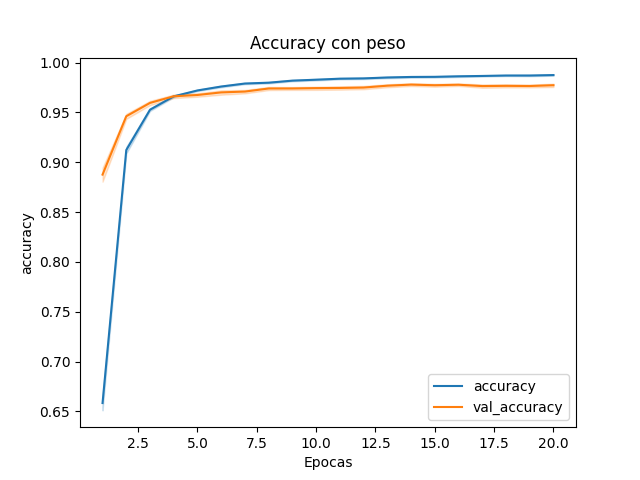

# Estudio comparativo de modelos de aprendizaje profundo con el propósito de clasificar enfermedades en los cultivos de caña de azúcar.

Un gran desafío para los agricultores mexicanos es lidiar con las enfermedades en sus cultivos, las cuales afectan el rendimiento de los mismos y provocan costosos tratamientos. 
En cultivos de caña de azúcar, la __roya__, el __virus de la hoja amarilla__, el __mosaico__ y la __pudrición roja__ son algunas de las enfermedades de gran impacto económico. 
El __deep learning__ es una forma de abordar este desafío, mediante la clasificación de imágenes de hojas enfermas.
En este repositorio se describe un análisis comparativo sobre clasificación de hojas de caña de azúcar enfermas utilizando 3 modelos de deep learning: __EfficientNetV2B0__, __DenseNet121__ y __ResNet101V2__.

## Propósito.
Ayudar a los agricultores a detectar eficientemente y de forma sencilla las enfermedades del cultivo, proporcionando una herramienta tecnológica. 
El mejor modelo estará en una aplicación de uso libre para el público en general.

## Metodología.
Para evaluar la eficiencia de los modelos se utilizó:
* Un enfoque experimental que incluyó aumento de datos para mejorar el rendimiento de los modelos.
* Se utilizaron las arquitecturas EfficientNetV2B0, DenseNet121 y ResNet101V2 como extractores de características.
* Se crearon clasificadores específicos para cada arquitectura, encargados de procesar el vector obtenido y de la clasificación precisa de la imagen.
* 155 muestras de entrenamiento utilizando métricas de __Accuracy__, __Precisión__, __Recall__, y __F1__.
* Pruebas estadísticas.

## Conjunto de imágenes.
Buscando el conjunto de imágenes de enfermedades de la caña de azúcar, se identificaron dos datasets relevantes y disponibles en la plataforma __Kaggle__. Al combinar los conjuntos, se obtuvo un total de 3785 imágenes en formatos JPG, PNG y JPEG. A este conjunto de imágenes se les hizo un preprocesamiento, obteniendo un total de __1500__ fotografías por cada clase.

> [!NOTE]  
> El conjunto de imágenes que se utilizó se encuentra en la carpeta 'Enfermedad'.

## Modelos
Para cada modelo se utilizo un clasificador diferente, adaptandose a las necesidades de cada extractor de caracteristicas. Para el entrenamiento, validacion y pruebas se utilizo:
* __Optimizador Adam__,
* __One-hot__ encoding para el formato de las etiquetas.
* Función de perdida __Categorical Cross Entropy__

> [!IMPORTANT]  
> La configuración del clasificador se encuentra en los archivos de prueba_nombre_modelo. Ejemplo 'Prueba_DenseNet121_B.py'

## Entrenamiento
Se realizó una división en los datos utilizando K-Fold Cross-Validation en 31 iteraciones dando como resultado 155 muestras evaluadas con las métricas mencionadas anteriormente con las imagenes de entrenamiento, validación y test.

## Análisis de resultados.
El resultado de cada analisis fue utilizando las 155 muestras de cada modelo.

Primeramente se analizó el comportamiento del accuracy durante el entrenamiento para verificar que no haya algun sobreajuste o subajuste.

Se analizó la distribución de la metrica accuracy para los tres conjuntos de datos.

Se realizó la prueba de normalidad de Shapiro Wilk para verificar si los datos siguen una distribución normal.

AL no seguir una normalidad se opto por mostrar los resultados de la mediana y IQR.

<table>
  <thead>
  <tr>
    <th colspan="7">Accuracy</th>
  </tr>
   <tr>
    <td rowspan="2"><b>Models</b></td>
    <td colspan="2"><b>Training set</b></td>
    <td colspan="2"><b>Validation set</b></td>
    <td colspan="2"><b>Test set</b></td>
  </tr>
  <tr>
    <td>&#x0078;&#x0303;</td>
    <td>IQR</td>
    <td>&#x0078;&#x0303;</td>
    <td>IQR</td>
    <td>&#x0078;&#x0303;</td>
    <td>IQR</td>
  </tr>
</thead>
<tbody>
    <tr>
        <td>EfficientNetV2B0</td>
        <td>0.9965</td>
        <td>0.0052</td>
        <td>0.9792</td>
        <td>0.0096</td>
        <td>0.9773</td>
        <td>0.0100 </td>
    </tr>
    <tr>
          <td>DenseNet121</td>
          <td>0.9723</td>
          <td>0.0280</td>
          <td>0.9500</td>
          <td>0.0317</td>
          <td>0.9447</td>
          <td>0.0333 </td>
      </tr>
      <tr>
          <td>ResNet101V2</td>
          <td>0.8779</td>
          <td>0.1480</td>
          <td>0.8500</td>
          <td>0.1313</td>
          <td>0.8447</td>
          <td>0.1397 </td>
      </tr>
</tbody>
</table>

Por ultimo se realizó una prueba de Dunn para ver que distribuciones de los modelos son similares.

## Resultado final.
El mejor modelo fue el __EfficientNetV2B0__ por su alto accuracy y su perdida baja. El modelo fue puesto como un web service utilizando flask para el apartado de api y utilizando docker para crear un contendedor. Aparte incluye una pagina web con interfaz grafica en el cual puedes comprobar el funcionamiento. Todo lo puedes encontrar en [aquí](https://github.com/JesusDMM/Modelo_IA_Docker)

Todos los resultados de todas las metricas para cada modelo en especifico lo puedes encontrar [aquí](https://github.com/JesusDMM/SugarCane)
